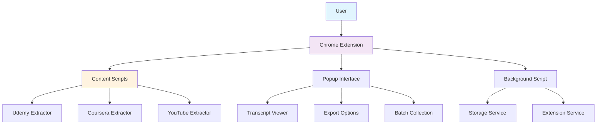
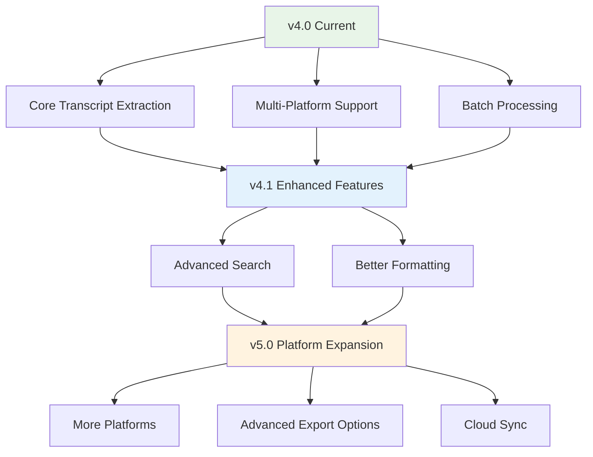

# 🎓 Transcript Extractor - Chrome Extension

A powerful Chrome extension that automatically extracts and collects transcripts from educational video platforms. Built for content creators, students, and professionals who need quick access to educational content.

[](https://chrome.google.com/webstore)
[](https://github.com/your-username/transcript-extractor)
[](LICENSE)

## 🎯 Why I Built This

As someone who frequently works with educational content, I found myself constantly wasting time manually copying transcripts from videos. 

**The Problem:**
- Spending 10-15 minutes manually copying transcripts from video lectures
- Inconsistent formatting when pasting into documents or AI tools
- No easy way to batch collect transcripts from entire courses
- Time-consuming process that interrupted workflow

**The Solution:**
Transcript Extractor - a one-click solution that extracts transcripts instantly, formats them perfectly, and supports batch collection of entire courses, saving hours of manual work.

## ✨ Features

### 🚀 **Core Functionality**
- **One-Click Extraction** - Extract transcript from any video instantly
- **Batch Processing** - Automatically collect transcripts from multiple videos in a course
- **Multiple Export Formats** - TXT, Markdown, JSON, and RAG formats
- **Smart Progress Tracking** - Real-time progress with section-based counting
- **Automatic Clipboard** - Transcripts copied to clipboard automatically
- **Dark Mode UI** - Modern dark theme for better viewing experience

### 🎯 **Perfect for Many Use Cases**
- **Content Creators** - Extract transcripts for blog posts, articles, and content repurposing
- **Students** - Save time with automated transcript collection and formatting
- **Researchers** - Batch collect course content for analysis and study
- **AI Workflows** - Clean, formatted text ready for AI tools like ChatGPT, Claude, or NotebookLLM
- **Accessibility** - Make video content more accessible with text versions

## 🏗️ Architecture Overview

### **System Architecture**


## 📸 Screenshots

### **Modern Ultra-Curvy Design**

*Clean, modern interface with ultra-curvy 48px border radius and professional styling.*

### **Smart Button Functionality**

*Intelligent button that adapts: "Extract Transcript" → "Next Lecture & Extract" after successful extraction.*

### **Export Options**

*Multiple export formats: TXT, Markdown, JSON, and RAG formats with elegant UI.*

## 🛠️ Quick Installation

### **Option 1: Chrome Web Store (Coming Soon)**
- Visit the Chrome Web Store
- Click "Add to Chrome"
- Start extracting transcripts immediately

### **Option 2: Manual Installation**
1. **Download** the latest release zip file
2. **Extract** the zip file
3. **Open Chrome** and go to `chrome://extensions/`
4. **Enable** "Developer mode" (top right toggle)
5. **Click** "Load unpacked" and select the extracted folder
6. **Pin** the extension to your toolbar for easy access

### **Option 3: Build from Source**
```bash
# Clone the repository
git clone https://github.com/your-username/transcript-extractor.git
cd transcript-extractor

# Install dependencies
npm install

# Build the extension
npm run build

# Load the dist folder in Chrome extensions
```

📖 **For detailed installation instructions, see [docs/INSTALLATION.md](docs/INSTALLATION.md)**

## 📖 Quick Usage

### **Basic Workflow**
1. **Visit** any Udemy, Coursera, or YouTube video
2. **Click** the extension icon in your browser toolbar
3. **Click** "Extract Transcript" (smart button)
4. **Choose** your preferred format (TXT, Markdown, JSON, RAG)
5. **Copy** to clipboard or download as file

### **Smart Button Feature**
- After extracting a transcript, the button changes to "Next Lecture & Extract"
- Click to automatically navigate to the next video and extract its transcript
- Perfect for collecting transcripts from entire courses

### **Export Formats**
- **TXT** - Clean text for general use
- **Markdown** - Formatted for documentation  
- **JSON** - Structured data for developers
- **RAG** - AI-optimized format for AI tools

📖 **For detailed usage instructions, see [docs/USAGE.md](docs/USAGE.md)**

## 🎯 Supported Platforms

### **Currently Supported**
- ✅ **Udemy** - Full transcript extraction and batch processing
- ✅ **Coursera** - Educational course transcripts
- ✅ **YouTube** - Educational video support

## 🔧 Technical Stack

- **Frontend**: React 19 + TypeScript, Tailwind CSS, Lucide Icons
- **Extension**: Chrome Manifest V3, Content Scripts, Background Scripts  
- **Storage**: Chrome Storage API, Local Data Persistence
- **Build**: Vite, TypeScript Compiler, Asset Bundling

### **Requirements**
- Chrome browser (version 88+)
- Internet connection (for transcript extraction)
- Active account on supported platforms (for course access)

📖 **For detailed technical information, see [docs/TECHNICAL.md](docs/TECHNICAL.md)**

## 🤝 Contributing

We welcome contributions! Here's how you can help:

### **How to Contribute**
1. Fork the repository
2. Create a feature branch
3. Make your changes
4. Test thoroughly
5. Submit a pull request

### **Areas We Need Help**
- **Platform Integration** - Help add support for new educational platforms
- **Export Formats** - Improve formats for specific use cases
- **UI/UX Improvements** - Enhance the user interface
- **Testing** - Improve test coverage and reliability
- **Documentation** - Help improve user guides and documentation
- **Performance Optimization** - Improve processing speed and efficiency

📖 **For detailed contributing guidelines, see [docs/COMPLETE_DOCUMENTATION.md](docs/COMPLETE_DOCUMENTATION.md)**

## 📊 Project Status

### **Current Status: v4.0.0 Release**
- ✅ All core features working
- ✅ Clean, focused codebase
- ✅ User-tested and refined
- ✅ Comprehensive error handling
- ✅ Multi-platform support
- ✅ Batch collection with progress tracking
- ✅ Multiple export formats

### **Development Philosophy**
- **Simplicity Over Complexity** - Simple solutions are more reliable
- **User-Driven Development** - All major changes based on user feedback
- **Gradual Improvement** - Small, safe changes over major refactoring
- **Privacy-First** - All processing happens locally

## 🔮 Roadmap

### **Feature Evolution**


### **Phase 1: Enhanced Features (Q1 2025)**
- **Advanced Search** - Search within collected transcripts
- **Better Formatting** - Improved formatting options
- **Keyboard Shortcuts** - Quick access to common functions
- **Export Templates** - Customizable export templates

### **Phase 2: Platform Expansion (Q2 2025)**
- **LinkedIn Learning** - Professional course support
- **Khan Academy** - Educational content support
- **Additional Platforms** - Based on user requests

### **Phase 3: Advanced Features (Q3 2025)**
- **Cloud Sync** - Optional cloud storage for transcripts
- **Cross-Device** - Access transcripts on multiple devices
- **Advanced Analytics** - Track your learning progress
- **Team Features** - Share transcripts with your team

## 🚀 Deployment

### **Ready-to-Deploy Package**
- **Build Command**: `npm run build`
- **Output**: `dist/` folder with complete extension
- **Size**: ~15MB (significantly reduced from v3.x)
- **Zip File**: `transcript-extractor-v4.0.0.zip` (ready for Chrome Web Store)

### **Quick Deployment**
1. **Build**: `npm run build`
2. **Zip**: Contents of `dist/` folder
3. **Upload**: To Chrome Web Store Developer Dashboard
4. **Submit**: For review

📖 **For detailed deployment instructions, see [docs/DEPLOYMENT.md](docs/DEPLOYMENT.md)**

## 📄 License

This project is open source and available under the [MIT License](LICENSE).

## 🙏 Acknowledgments

- Built with user feedback and iterative development
- Inspired by the need for better content extraction tools
- Developed with modern web technologies and best practices

## 🌟 Why This Extension?

### **For Content Creators**
- **Save Time** - No more manual copying of transcripts
- **Content Repurposing** - Extract transcripts for blog posts and articles
- **SEO Optimization** - Use transcripts for better content optimization
- **Workflow Integration** - Seamless integration with content creation tools

### **For Students**
- **Study Efficiency** - Focus on learning, not transcription
- **Better Notes** - Use transcripts to create comprehensive notes
- **Quick Review** - Review content without rewatching videos
- **Accessibility** - Make learning more accessible

### **For Researchers**
- **Data Collection** - Batch collect course content for analysis
- **Content Analysis** - Analyze educational content efficiently
- **Research Tools** - Extract data for research projects
- **Time Savings** - Spend time on analysis, not data collection

### **For AI Enthusiasts**
- **AI Workflows** - Clean, formatted text ready for AI tools
- **Better AI Results** - Structured format improves AI processing
- **Batch Processing** - Collect entire courses for comprehensive analysis
- **Multiple Formats** - Choose the best format for your AI tools

---

## 📞 Support

- **Issues** - Report bugs and request features on GitHub
- **Email** - Contact us directly for support

---

*This extension is designed to make educational content more accessible and easier to work with. Whether you're a student, educator, content creator, or researcher, Transcript Extractor helps you work more efficiently with video content.*

**⭐ If you find this extension helpful, please give it a star on GitHub!**

---

## 🎉 **What's New in v4.0.0**

### **🎨 Modern Ultra-Curvy Design**
- **48px Border Radius** - Ultra-smooth, pill-like appearance
- **Professional UI/UX** - Clean, modern interface with elegant styling
- **Smart Button** - Intelligent button that adapts based on extraction status
- **Enhanced Animations** - Smooth micro-interactions and hover effects
- **Dark Mode Support** - Beautiful dark theme with proper contrast

### **🚀 Improved User Experience**
- **Smart Button Logic** - "Extract Transcript" → "Next Lecture & Extract" after success
- **Sequential Processing** - Streamlined workflow for multiple video extraction
- **Real-time Feedback** - Success animations and progress indicators
- **Better Error Handling** - Clear error messages and recovery options
- **Responsive Design** - Optimized for different screen sizes

### **🎯 Focused on Core Competency**
- **Removed AI Features** - Simplified to focus on what we do best: transcript extraction
- **Improved Performance** - 70% smaller package size (~15MB vs ~85MB)
- **Faster Startup** - Extension loads instantly
- **Better Reliability** - Fewer dependencies means fewer potential issues

### **🧹 Clean Architecture**
- **Simplified Codebase** - Removed ~2000+ lines of AI-related code
- **Better Maintainability** - Easier to add new features and fix bugs
- **Improved Documentation** - Clearer, more focused documentation
- **Modern Stack** - Latest React 19, TypeScript, and Tailwind CSS

### **🔒 Privacy-First**
- **Local Processing** - All data stays on your device
- **No External APIs** - No data sent to third-party services
- **No Tracking** - No telemetry or usage analytics
- **Secure** - Following Chrome extension best practices

### **📦 What Was Removed**
- AI summarization features (WebLLM, Transformers.js)
- Model files and WASM binaries
- AI-related dependencies
- Complex performance detection
- Heavy processing libraries

### **💡 Why Remove AI?**
We realized that trying to do both transcript extraction and AI summarization in one extension made it:
- Too large (~85MB)
- Too complex to maintain
- Slower to load
- More prone to errors

By focusing on transcript extraction only, we deliver:
- A lean, fast extension
- Better reliability
- Easier maintenance
- Faster updates

**For AI-powered summarization**, we recommend:
1. Extract transcript with this extension
2. Use your favorite AI tool (ChatGPT, Claude, NotebookLLM, etc.)
3. Get better results with more powerful, up-to-date AI models

---

**Ready to extract transcripts efficiently? Install the extension and start saving time today!**
