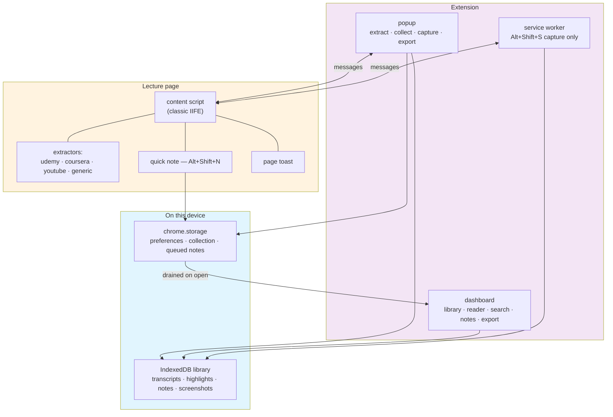

# 🎓 Transcript Extractor

A Chrome extension that turns video lectures into notes you can search, mark up and take
elsewhere — entirely on your own machine.

[](https://chrome.google.com/webstore)
[](https://github.com/pras-ops/udemy-transcript-extractor)
[](LICENSE)

No account, no server, no telemetry. The extension makes **no network requests at all** while it
runs.

---

## 🎯 The problem

Watching a lecture and keeping notes from it are two activities that fight each other.

- Raw captions are unreadable as notes — no paragraphs, filler words everywhere, one line every two
  seconds.
- Writing a five-word realisation means pausing, alt-tabbing to a notes app, finding the right page,
  typing, and coming back to hunt for your place again.
- Diagrams and code on screen never make it into the transcript at all.
- A month later you remember a concept but not which of forty lectures it was in.
- Udemy ignores `#t=` in its URLs, so a timestamp in your notes is a number you scrub for by hand.

This extension closes that loop: **watch → capture or note without leaving the video → read as
prose → mark a passage → jump back to the exact moment → search every course at once → export.**

---

## ✨ What it does

### Extract

- **One click, any lecture.** Dedicated extractors for Udemy, Coursera and YouTube, plus a generic
  extractor that reads caption data from any standard HTML5 player — Panopto, Kaltura, Echo360,
  Canvas Studio, Moodle, edX and most self-hosted lecture players.
- **A whole course, not one video.** Lectures accumulate as you work through a course, and the
  *Next lecture & extract* button walks the curriculum for you.
- **Cleanup that matters.** Filler words removed, duplicate and rolling caption lines collapsed,
  out-of-order cues repaired (Udemy's transcript panel is virtualised and hands them over scrambled),
  and technical vocabulary repaired — "Jupiter notebook" → "Jupyter Notebook", "numb pie" → "NumPy".

### Study

- **A reader, not a caption dump.** The transcript is grouped into paragraphs, with a toggle back to
  line-per-cue when you want to see exactly where each one starts.
- **Highlight and annotate.** Mark a passage and it captures the moment it was said, so you never
  type a timestamp. Attach your own note to a highlight — a quote and what you made of it stay one
  thought.
- **Notes while watching.** `Alt+Shift+N` on the lecture page opens a composer over the video. It
  pauses, takes the moment you reacted to, and saves. No alt-tab.
- **Screenshots while watching.** `Alt+Shift+S` captures the frame you are looking at. A transcript
  cannot show a diagram or a line of code; the still can.
- **Jump back to the video.** Every timestamp — in the reader, your highlights, your notes, search
  results — puts the lecture's own player on that moment.

### Understand

All of this is derived from the transcript by selection and statistics, so nothing is invented:

- **Chapters**, from TextTiling over embedding similarity.
- **Key concepts**, KeyBERT-style with MMR for diversity.
- **Definitions the lecturer actually stated**, matched with Hearst patterns ("X is a Y").
- **Key moments** — the lecturer's own most representative sentences.

### Search

- **Across every course at once**, by meaning rather than exact words. Keyword search is usable
  immediately; the meaning tier loads behind it and upgrades the results.
- Returns **passages with timestamps** rather than a generated answer, so it cannot tell you
  something that was never said.

### Export

- **Study notes (Markdown)** — the transcript with your highlights marked `==inline==`, your notes at
  their moments, and text read off your screenshots in fenced blocks. Or just the digest, without the
  transcript.
- **A whole course** as one document.
- **Ten transcript formats** for everything else.

| Format | Best for |
| --- | --- |
| **Study notes** (`.md`) | Obsidian, Notion, Logseq — your own marks included |
| **Markdown** / **Organised** (`.md`) | Readable notes with timestamps and headings |
| **Obsidian** (`.md`) | Vault-ready, with frontmatter |
| **Plain text** (`.txt`) | Anywhere |
| **Retrieval chunks** (`.json`) | Vector stores, NotebookLM — pre-chunked with context headers |
| **JSON** (`.json`) | Your own scripts |
| **SubRip** (`.srt`) / **WebVTT** (`.vtt`) | Video editors, players, re-upload |
| **CSV** (`.csv`) | Excel, Google Sheets |
| **Anki** (`.csv`) | Cloze cards built from stated definitions |

---

## 🧠 Why there is no language model in here

This is the most consequential decision in the project, and it is worth explaining properly —
especially because the answer is *not* "we switched to Google's AI".

### What was here before

Version 3 shipped **WebLLM**: a real language model running inside the browser. It worked, and it
was unshippable.

- A **multi-gigabyte model download** before the first use.
- **WebGPU required** — absent on a large share of the machines students actually own.
- A **WASM runtime**, which forced `'wasm-unsafe-eval'` into the extension's CSP.
- It fetched a compiled `.wasm` library **from a CDN at runtime**. Manifest V3 forbids remotely
  hosted code and the Chrome Web Store counts WASM as code, so this alone made the extension
  impossible to publish.
- Four high-severity dependency vulnerabilities came along with the runtime.

### What replaced it

Rather than find a smaller model, 4.2.0 asked what the model was actually *for* and split it in two.

**Tier one — statistics, and it works on every machine.**

Search uses **Model2Vec `potion-base-8M` static embeddings**, which is a lookup table rather than a
model. Embedding a token is an array index, not a forward pass. That means no inference runtime, no
WASM, no GPU, and identical speed on a ten-year-old laptop. The table ships *inside* the extension
package (~30 MB), so nothing is downloaded and nothing is fetched at runtime.

Everything in **Understand** above is built on the same footing — TextTiling, MMR, Hearst patterns,
extractive summarisation. All selection, no generation. None of it can hallucinate, because none of
it writes anything.

**Tier two — Chrome's own on-device model, optional.**

Two features genuinely need generation: prose summaries, and reading text off a captured frame.
Those use **Chrome's built-in on-device model (Gemini Nano)** through the Summarizer and Prompt APIs.

This is where Google comes in, and the distinction matters:

- The extension **does not ship or download a model**. Chrome owns it as a browser feature.
- **Nothing leaves your machine.** The model runs locally; your screenshots and transcripts are not
  sent to Google or anyone else.
- It is **probed, never assumed** (`probeSummarizer`, `probeImageModel`). Where the browser or
  hardware does not support it, those two features are simply not offered, and everything else is
  unaffected.

Be aware of the consequence: **most users will not have tier two.** It needs a recent Chrome,
capable hardware, and a one-time model download that Chrome manages. The features that work
everywhere are search, the reader, chapters, concepts, definitions, extractive summaries, seek and
every export.

`npm run check:store` enforces the no-remote-code property on every single build, so this cannot
quietly regress.

---

## 🏗️ Architecture

Four contexts, each with one job.


```mermaid
graph TB
    subgraph page["Lecture page"]
        CS["content script<br/>(classic IIFE)"]
        EX["extractors:<br/>udemy · coursera · youtube · generic"]
        QN["quick note — Alt+Shift+N"]
        TO["page toast"]
    end

    subgraph ext["Extension"]
        PU["popup<br/>extract · collect · capture · export"]
        DB["dashboard<br/>library · reader · search · notes · export"]
        SW["service worker<br/>Alt+Shift+S capture only"]
    end

    subgraph store["On this device"]
        IDB["IndexedDB library<br/>transcripts · highlights · notes · screenshots"]
        CST["chrome.storage<br/>preferences · collection · queued notes"]
    end

    CS --- EX
    CS --- QN
    CS --- TO
    PU <-->|messages| CS
    SW <-->|messages| CS
    PU --> IDB
    DB --> IDB
    SW --> IDB
    PU --> CST
    QN --> CST
    CST -->|drained on open| DB

    style page fill:#fff3e0
    style ext fill:#f3e5f5
    style store fill:#e1f5fe
```

Two details that are load-bearing rather than incidental:

**The service worker has exactly one job.** Capturing a frame needs
`chrome.tabs.captureVisibleTab`, and a content script has no `chrome.tabs` at all. The `activeTab`
permission it depends on is only granted when the user *invokes* the extension — a keypress on the
page is not that, but a `chrome.commands` shortcut is. That is the entire reason the worker exists.
Notes need no such thing, which is why `Alt+Shift+N` is a plain listener on the page.

**Notes written on the page cannot reach the library directly.** A content script's `indexedDB` is
the *site's*, not the extension's — writing there would file a note about a lecture into Udemy's
storage, where nothing would ever read it. So notes queue in `chrome.storage` and the dashboard
drains them when it opens. A note survives closing the tab, the browser, or the machine, but it
appears in the dashboard the next time you open it rather than instantly.

📖 **Full detail in [docs/TECHNICAL.md](docs/TECHNICAL.md)**

---

## 🛠️ Installation

### Chrome Web Store

Coming soon.

### Load unpacked

1. Download the latest release zip and extract it
2. Open `chrome://extensions/`
3. Enable **Developer mode**
4. **Load unpacked** → select the extracted folder
5. Pin the extension to your toolbar

### Build from source

```bash
git clone https://github.com/pras-ops/udemy-transcript-extractor.git
cd udemy-transcript-extractor
npm install

# Fetch the bundled search model (~30 MB, one time).
# The weights are a build input and are not committed.
npm run fetch:model

# Typecheck, lint, test
npm run verify

# Build, then check against Chrome Web Store rules
npm run deploy

# Load the dist/ folder at chrome://extensions
```

| Script | What it does |
| --- | --- |
| `npm run fetch:model` | Downloads the search model into `public/models/` |
| `npm run verify` | Typecheck + lint + tests |
| `npm run build` | Typecheck, then the popup, content script and worker bundles |
| `npm run build:extension` | Production build plus manifest, icons and model assets |
| `npm run check:store` | Fails if anything would be rejected by the store |
| `npm run deploy` | `build:extension` then `check:store` |

📖 **See [docs/INSTALLATION.md](docs/INSTALLATION.md)**

---

## 📖 Using it

### Extract

1. Open a lecture and make sure its transcript panel is open — the extension reads what the player
   renders, it does not transcribe audio itself
2. Click the extension icon → **Extract transcript**
3. Keep going with **Next lecture & extract** to collect the course

### While watching

| Shortcut | Does |
| --- | --- |
| `Alt+Shift+N` | Write a note against the current moment |
| `Alt+Shift+S` | Capture the frame on screen |

Both pause the video, take the moment, and resume. Rebind them at
`chrome://extensions/shortcuts` — and check there first if one does nothing, because Chrome drops a
conflicting shortcut without warning.

### Review

Open the dashboard from the popup for the library, the reader, cross-course search, your highlights
and your notes. Click any timestamp anywhere to send the lecture's player back to that moment — the
lecture tab needs to be open, and if it is not, the extension opens it.

📖 **See [docs/USAGE.md](docs/USAGE.md)**

---

## 🎯 Supported platforms

**Dedicated extractors** — Udemy, Coursera, YouTube.

**Everything else** — a generic extractor reads caption data directly rather than scraping any
site's markup, using the browser's own `TextTrack` API, `<track>` elements and the caption files the
player fetches. That covers most lecture-capture and LMS players with **no extra permissions**.

If a platform serves captions through a protected endpoint, the extension says so rather than
failing silently.

---

## ⚠️ Known limitations

Worth knowing before you rely on it:

- **No backup or restore yet.** The library lives in one browser profile's IndexedDB. Clearing site
  data, switching machines or corrupting a profile loses it. Markdown export is per lecture or per
  course and is not a restore path. This is the next thing on the roadmap.
- **One machine.** There is no sync, by design — but that does mean your notes are where you made
  them.
- **DRM blocks frame capture.** A protected player returns a black rectangle rather than an error.
  The extension detects that and tells you capture is unavailable, rather than filling your notes
  with black images.
- **Tier-two AI is often absent.** See above — OCR and prose summaries need Chrome's on-device
  model.
- **The extractors depend on other people's markup.** A site redesign can break extraction. That is
  the fragile part of this project and always will be.

---

## 🔒 Privacy

Everything runs on your machine, and the build enforces it:

- No network calls at runtime — the search model ships inside the package
- No telemetry, analytics, crash reporting or remote configuration
- No account, ever
- Host permissions limited to the three supported platforms; **no all-URLs permission**, and
  `check:store` fails the build if one appears
- CSP is `script-src 'self'` — no `wasm-unsafe-eval`, because nothing evaluates generated code

📖 **Full policy in [PRIVACY.md](PRIVACY.md)**

---

## 🔧 Stack

| Layer | Choice |
| --- | --- |
| UI | React 19, TypeScript (strict), Tailwind, Lucide |
| Extension | Chrome Manifest V3 |
| Build | Vite (three configs — popup, content script, worker), Vitest |
| Search | Model2Vec static embeddings + BM25, fused with RRF |
| Storage | IndexedDB for the library, `chrome.storage` for preferences |

**Requirements:** Chrome 88+ for everything in tier one — Manifest V3, the service worker and the
`commands` shortcuts all date from there. The tier-two AI features need a considerably newer Chrome
plus supported hardware; the extension probes rather than checking a version number, so the honest
answer is "it will tell you". Node 18+ to build.

---

## 📊 Status

**v4.3.0** — 543 tests across 24 files; typecheck, lint and the eight Chrome Web Store compliance
gates all pass.

### Development philosophy

- **Simple over clever** — a small amount of code that works beats a general mechanism
- **Local-first** — if a feature needs a server, it is the wrong feature
- **Selection over generation** — never invent something the lecturer did not say
- **Degrade honestly** — a feature that cannot work is not offered, rather than failing when pressed

---

## 🔮 What's next

1. **Backup and restore** — a JSON dump of the library and a way to load it back. The most important
   missing piece.
2. **Honest extraction failure** — when a site redesign breaks a selector, say *"the site changed,
   update the extension"* rather than returning nothing.
3. **Real captured fixtures** for the extractor tests — see the caveat in
   [docs/TECHNICAL.md](docs/TECHNICAL.md).
4. **Onboarding** — nothing currently tells a new user the dashboard exists.
5. **More platforms** — LinkedIn Learning, Khan Academy, on request.

---

## 🤝 Contributing

Fork, branch, `npm run verify`, pull request.

Most useful areas: platform extractors and their fixtures, export formats, and anything that makes
failure more legible.

📖 **Architecture and setup in [docs/TECHNICAL.md](docs/TECHNICAL.md)**

---

## 📄 License

MIT — see [LICENSE](LICENSE).

## 📝 Changelog

Release history in **[CHANGELOG.md](CHANGELOG.md)**.

## 📞 Support

Issues and feature requests on GitHub. 📧 jacobprashant20@gmail.com

---

**⭐ If this saves you time, a star on GitHub is appreciated.**
