# 🎓 Transcript Extractor - Chrome Extension

A powerful Chrome extension that automatically extracts and collects transcripts from educational video platforms with **AI-powered dynamic subject detection and intelligent summarization**. Built for AI enthusiasts who need quick access to educational content for tools like NotebookLLM, ChatGPT, and other AI platforms.

[](https://chrome.google.com/webstore)
[](https://github.com/your-username/transcript-extractor)
[](LICENSE)
[](https://github.com/your-username/transcript-extractor)

## 🎯 Why I Built This

As someone who heavily uses AI tools like **NotebookLLM**, **ChatGPT**, and other AI platforms for learning and content creation, I found myself constantly wasting time manually copying transcripts from educational videos. 

**The Problem:**
- Spending 10-15 minutes manually copying transcripts from Udemy videos
- Inconsistent formatting when pasting into AI tools
- No easy way to batch collect transcripts from entire courses
- Time-consuming process that interrupted my learning flow
- Long transcripts are hard to digest and analyze

**The Solution:**
Transcript Extractor with **AI-powered summarization** - a one-click solution that extracts transcripts instantly, formats them perfectly for AI tools, AND provides intelligent summaries using local AI models, saving hours of manual work.

## ✨ Features

### 🚀 **Core Functionality**
- **One-Click Extraction** - Extract transcript from any Udemy video instantly
- **Batch Processing** - Automatically collect transcripts from multiple videos in a course
- **AI-Optimized Formats** - Support for TXT, Markdown, JSON, and RAG formats perfect for AI tools
- **Smart Progress Tracking** - Real-time progress with section-based counting
- **Automatic Clipboard** - Transcripts copied to clipboard automatically
- **Dark Mode UI** - Modern dark theme for better viewing experience

### 🤖 **AI-Powered Features**
- **Local AI Summarization** - WebLLM (GPU) + Transformers.js (CPU) + Basic Fallback
- **Adaptive Length Control** - Smart summary length calculation (50% of original by default)
- **Real-time Statistics** - Word count, compression ratio, and processing metrics
- **Multiple AI Engines** - Choose between GPU-accelerated or CPU-based processing
- **Privacy-First** - All AI processing happens locally in your browser
- **Always Works** - Graceful fallback ensures summarization never fails

### 🎯 **Perfect for AI Workflows**
- **NotebookLLM** - Extract and paste transcripts for AI-powered note-taking
- **ChatGPT** - Get clean, formatted text for AI conversations
- **Claude** - Batch collect course content for analysis
- **Custom AI Tools** - RAG format optimized for vector databases
- **AI Summarization** - Get intelligent summaries before feeding to AI tools
- **Study Efficiency** - Focus on key points instead of reading full transcripts

## 🏗️ Architecture Overview

### **System Architecture**


### **AI Processing Flow**


## 📸 Screenshots

### **Single Transcript Extraction**

*Extract transcripts from individual videos with one click. Supports multiple export formats including RAG for AI tools.*

### **Batch Collection Mode**

*Automatically collect transcripts from entire course sections. Perfect for comprehensive AI analysis.*

### **Active Batch Processing**

*Real-time progress tracking shows exactly what's being processed. Navigate through lectures automatically.*

### **AI Summarization Interface**

*Modern AI-powered summarization with adaptive length control, real-time statistics, and multiple engine support.*

## 🛠️ Installation

### **Option 1: Chrome Web Store (Coming Soon)**
- Visit the Chrome Web Store
- Click "Add to Chrome"
- Start extracting transcripts immediately

### **Option 2: Manual Installation (Developer Mode)**
1. **Build** the extension from source (see Option 3 below)
2. **Open Chrome** and go to `chrome://extensions/`
3. **Enable** "Developer mode" (top right toggle)
4. **Click** "Load unpacked" and select the `dist` folder
5. **Pin** the extension to your toolbar for easy access

### **Option 3: Build from Source**
```bash
# Clone the repository
git clone https://github.com/your-username/transcript-extractor.git
cd transcript-extractor

# Install dependencies
npm install

# Build the extension
npm run build

# Load the dist folder in Chrome extensions
```

## 📖 Usage Guide

### **User Workflow**


### **Feature Comparison**
| Feature | Before AI | With AI | Benefit |
|---------|-----------|---------|---------|
| **Transcript Length** | Full transcript (2000+ words) | Smart summary (500 words) | **75% time savings** |
| **Processing Time** | Manual reading (10-15 min) | AI processing (5-15 sec) | **60x faster** |
| **Key Points** | Manual identification | AI extraction | **Better focus** |
| **AI Tool Input** | Raw transcript | Optimized summary | **Better AI results** |
| **Study Efficiency** | Read everything | Focus on essentials | **Improved learning** |
| **Privacy** | External processing | Local processing | **100% private** |

### **For AI Tool Integration**

#### **1. Single Video Extraction**
1. Go to any Udemy course video
2. Click the extension icon in your browser toolbar
3. Click "Extract Transcript"
4. Choose your preferred format:
   - **TXT** - Clean text for ChatGPT
   - **Markdown** - Formatted for NotebookLLM
   - **JSON** - Structured data for custom AI tools
   - **RAG** - AI-optimized format for vector databases
5. Transcript is automatically copied to your clipboard
6. Paste directly into your AI tool

#### **2. Batch Collection for Course Analysis**
1. Navigate to a Udemy course
2. Click the extension icon
3. Enable "Batch Collection Mode"
4. Choose your collection preferences
5. Click "Start Collection"
6. The extension automatically navigates through videos
7. Collect all transcripts for comprehensive AI analysis

### **AI Tool Workflows**

#### **NotebookLLM Workflow:**
1. Extract transcript in Markdown format
2. Paste into NotebookLLM
3. Use AI to create summaries, notes, and insights
4. Build comprehensive course knowledge base

#### **ChatGPT Workflow:**
1. Extract transcript in TXT format
2. Paste into ChatGPT
3. Ask questions about the content
4. Get explanations and clarifications

#### **Custom AI Analysis:**
1. Use RAG format for vector database ingestion
2. Build custom AI applications
3. Create searchable knowledge bases
4. Develop educational AI assistants

#### **AI Summarization Workflow:**
1. Extract transcript from video
2. Click "AI Summarize" button (appears after successful extraction)
3. **Auto-Generation**: Summary automatically starts generating
4. Configure compression settings:
   - **Compression Level**: 30% to 90% retention (default: 60%)
   - **Max Length Cap**: 200 to 2000 words maximum
   - **Example**: 1000 words → 600 words (60% retention)
5. Select AI engine:
   - **WebLLM** (GPU accelerated, fastest)
   - **Transformers.js** (CPU processing, universal)
   - **Basic Fallback** (always works, extractive)
6. View real-time statistics:
   - Original word count
   - Summary word count
   - Target length (compression mode)
   - Compression ratio
7. Copy summary or use for further AI processing

## 🤖 AI Summarization Features

### **AI Engines Comparison**

```mermaid
graph LR
    A[AI Summarization] --> B[WebLLM GPU]
    A --> C[Transformers.js CPU]
    A --> D[Basic Fallback]
    
    B --> E[🚀 Fastest<br/>5-15 seconds]
    B --> F[🎯 Best Quality<br/>Advanced Models]
    B --> G[⚡ GPU Accelerated<br/>WebGPU Required]
    
    C --> H[💻 Universal<br/>10-30 seconds]
    C --> I[🔄 Good Quality<br/>Standard Models]
    C --> J[🌐 Any Device<br/>CPU Processing]
    
    D --> K[📝 Always Works<br/>1-2 seconds]
    D --> L[🔧 Basic Quality<br/>Extractive Method]
    D --> M[📱 No Requirements<br/>Offline Capable]
    
    style B fill:#e8f5e8
    style C fill:#e3f2fd
    style D fill:#fce4ec
    style E fill:#c8e6c9
    style H fill:#bbdefb
    style K fill:#f8bbd9
```


### **Adaptive Length Calculation**


### **Available AI Engines**
- **🚀 WebLLM (GPU)** - Fast, powerful models with GPU acceleration
  - Models: Phi-3, Llama, Mistral
  - Requirements: WebGPU support, 2-4GB RAM
  - Best for: High-quality summaries, modern browsers
  - Speed: 5-15 seconds for typical summaries

- **💻 Transformers.js (CPU)** - Universal compatibility
  - Models: DistilBART, T5, BART
  - Requirements: Any browser, 200-400MB RAM
  - Best for: Universal compatibility, all devices
  - Speed: 10-30 seconds for typical summaries

- **📝 Basic Summary (Fallback)** - Always available
  - Method: Extractive summarization
  - Requirements: None
  - Best for: Quick summaries, offline use
  - Speed: 1-2 seconds for typical summaries

### **Smart Length Management**
- **📊 Compression Percentage System**: Intuitive control over summary length
  - **Default**: 60% retention (1000 words → 600 words)
  - **Range**: 30% to 90% retention (slider control)
  - **30% (Condensed)**: Very short, key points only
  - **60% (Balanced)**: Good detail with main concepts
  - **90% (Detailed)**: Comprehensive, close to original
  - **Smart Caps**: 200-2000 words maximum (configurable)
  - **Real-time Preview**: See target length as you adjust

- **🎯 Examples**:
  - 1000 words at 50% → 500 words
  - 2000 words at 70% → 1400 words
  - 500 words at 80% → 400 words

### **Privacy & Security**
- ✅ **100% Local Processing** - No data sent to external servers
- ✅ **Privacy-First** - Transcripts never leave your device
- ✅ **No Tracking** - No telemetry or usage analytics
- ✅ **Secure** - All processing happens in your browser
- ✅ **No API Keys Required** - No external service dependencies
- ✅ **Offline Capable** - Works without internet connection

### **Setup Instructions**
The extension works out-of-the-box with basic summarization. For advanced AI capabilities:

#### **Option 1: No Setup Required (Recommended)**
- Extension works immediately with basic summarization
- No installation or configuration needed
- Perfect for getting started quickly

#### **Option 2: Full AI Capabilities**
For GPU-accelerated AI and advanced models:
```bash
# For GPU acceleration (WebLLM)
npm install @mlc-ai/web-llm

# For universal compatibility (Transformers.js)
npm install @xenova/transformers
```

📚 **Detailed Setup Guide**: See [AI_SUMMARIZATION_GUIDE.md](AI_SUMMARIZATION_GUIDE.md)

## 🎯 Supported Platforms

### **Currently Supported**
- ✅ **Udemy** - Full transcript extraction and batch processing
- ✅ **Coursera** - Educational course transcripts
- ✅ **YouTube** - Educational video support


## 🔧 Technical Details

### **Technology Stack**


### **Privacy & Security Architecture**


### **Built With**
- **Chrome Extension Manifest V3** - Latest extension standards
- **React 19** with TypeScript - Modern, type-safe development
- **Tailwind CSS** - Clean, responsive UI
- **Vite** - Fast build system
- **WebLLM** - GPU-accelerated local AI models
- **Transformers.js** - Universal AI model support
- **Dynamic Imports** - Smart loading of AI libraries
- **Service Workers** - Background AI processing

### **Requirements**
- Chrome browser (version 88+)
- Internet connection (for transcript extraction)
- Active Udemy account (for course access)
- **AI Features**: No additional requirements (works out-of-the-box)
- **Advanced AI**: WebGPU support for GPU acceleration (optional)

## 🤝 Contributing

We welcome contributions! Here's how you can help:

### **Development Approach**
- **User-First** - All features driven by user feedback
- **Simplicity** - Prefer simple, reliable solutions
- **Incremental** - Small, safe improvements over major changes

### **How to Contribute**
1. Fork the repository
2. Create a feature branch
3. Make your changes
4. Test thoroughly
5. Submit a pull request

### **Areas We Need Help**
- **Platform Integration** - Help add support for new educational platforms
- **AI Tool Integration** - Improve formats for specific AI platforms
- **AI Model Integration** - Add support for new AI models and engines
- **UI/UX Improvements** - Enhance the user interface
- **Testing** - Improve test coverage and reliability
- **Documentation** - Help improve user guides and documentation
- **Performance Optimization** - Improve AI processing speed and efficiency

## 📊 Project Status

### **Current Status: v3.2.4 Release**
- ✅ All core features working
- ✅ AI summarization fully implemented
- ✅ User-tested and refined
- ✅ Clean, maintainable codebase
- ✅ Comprehensive error handling
- ✅ Multiple AI engines with fallbacks
- ✅ **Compression percentage control** - Retain 30-90% of original text
- ✅ Real-time statistics and monitoring
- ✅ **Persistent user settings** - Your preferences are saved and remembered
- ✅ **Auto-summarization** - Automatically generates summary when popup opens

### **Development Philosophy**
- **Simplicity Over Complexity** - Simple solutions are more reliable
- **User-Driven Development** - All major changes based on user feedback
- **Gradual Improvement** - Small, safe changes over major refactoring

## 🔮 Roadmap

### **Feature Evolution**

```mermaid
graph TD
    A[v3.1.0 Current] --> B[Basic AI Summarization]
    A --> C[WebLLM + Transformers.js]
    A --> D[Adaptive Length Control]
    
    B --> E[v4.0 Platform Expansion]
    C --> E
    D --> E
    
    E --> F[Coursera Support ✅]
    E --> G[YouTube Support ✅]
    
    F --> I[v5.0 Advanced AI]
    G --> I
    
    I --> J[Batch AI Processing]
    I --> K[Custom AI Models]
    I --> L[AI Tool Presets]
    
    J --> M[v6.0 Multi-Platform]
    K --> M
    L --> M
    
    M --> N[Cross-Platform Batch]
    M --> O[Direct AI Integration]
    M --> P[Advanced Formatting]
    
    style A fill:#e8f5e8
    style E fill:#e3f2fd
    style I fill:#fff3e0
    style M fill:#f3e5f5
```


### **Phase 1: Platform Expansion (Q1 2025)**
- **Coursera** - Full transcript extraction support ✅ **COMPLETED**
- **YouTube** - Educational video transcript collection ✅ **COMPLETED**

### **Phase 2: Enhanced AI Integration (Q2 2025)**
- **Multi-Platform Batch Processing** - Collect from multiple platforms simultaneously
- **AI Tool Presets** - Pre-configured formats for popular AI tools
- **Direct Integration** - One-click export to specific AI platforms
- **Advanced Formatting** - Custom formatting options for different use cases
- **🤖 Advanced AI Features** - Custom model selection, batch summarization, and AI-powered insights
- **AI-Powered Insights** - Generate study guides, key concepts, and learning objectives
- **Batch AI Processing** - Summarize multiple transcripts simultaneously
- **Custom AI Models** - Support for user-uploaded models

### **Phase 3: Multi-Platform Integration (Q3 2025)**
- **Cross-Platform Batch Processing** - Collect from multiple platforms simultaneously
- **Unified AI Processing** - Process transcripts from different platforms together
- **Advanced Analytics** - Cross-platform learning insights and progress tracking
- **Smart Recommendations** - AI-powered course and content suggestions

## 🚀 Deployment

### **Ready-to-Deploy Package**
The extension is ready for deployment by building from source:
- **Build Command**: `npm run build`
- **Output**: `dist/` folder with complete extension
- **Size**: ~3.7MB (includes all AI libraries)
- **Contents**: Complete extension with all features

### **Deployment Instructions**

#### **For Chrome Web Store**
1. Build the extension: `npm run build`
2. Zip the `dist/` folder contents
3. Upload to Chrome Web Store Developer Dashboard
4. Fill in store listing details
5. Submit for review

#### **For Enterprise/Internal Use**
1. Build the extension: `npm run build`
2. Distribute the `dist/` folder to users
3. Users can load via Developer Mode
4. Or package as zip for IT deployment tools

#### **For Testing/Development**
1. Build the extension: `npm run build`
2. Load in Chrome via `chrome://extensions/`
3. Enable Developer Mode
4. Click "Load unpacked" and select `dist/` folder

### **Package Contents**
```
dist/
├── manifest.json          # Extension manifest
├── background.js          # Background service worker
├── content-script.js      # Content script for page interaction
├── offscreen.js          # AI processing worker
├── transformers.js       # AI library bundle
├── index.js             # Main extension bundle
├── main.js              # UI components
├── main.css             # Styling
├── index.html           # Extension popup
└── icons/               # Extension icons
```

## 📄 License

This project is open source and available under the [MIT License](LICENSE).

## 🙏 Acknowledgments

- Built with user feedback and iterative development
- Inspired by the need for better AI tool integration
- Developed with modern web technologies and best practices

## 🌟 Why This Extension?

### **For AI Enthusiasts**
- **Save Time** - No more manual copying of transcripts
- **Better AI Results** - Clean, formatted text for better AI responses
- **Workflow Integration** - Seamless integration with AI tools
- **Batch Processing** - Collect entire courses for comprehensive analysis
- **AI Summarization** - Get intelligent summaries before feeding to AI tools
- **Local Processing** - Privacy-first AI that runs in your browser
- **Multiple Engines** - Choose the best AI model for your needs

### **For Students**
- **Study Efficiency** - Focus on learning, not transcription
- **AI-Powered Notes** - Use AI to create summaries and notes
- **Better Understanding** - Get AI explanations of complex topics
- **Quick Review** - Get key points from long lectures instantly
- **Adaptive Learning** - Adjust summary length to your study needs
- **Offline Study** - AI summaries work without internet connection

### **For Content Creators**
- **Content Repurposing** - Extract transcripts for blog posts, articles
- **AI-Assisted Writing** - Use AI to expand on educational content
- **SEO Optimization** - Use transcripts for better content optimization
- **AI Summaries** - Get intelligent summaries for content planning
- **Batch Processing** - Process multiple videos for comprehensive content
- **Local AI** - Privacy-first content processing

### **For Educators**
- **Content Analysis** - Extract and analyze course content
- **AI-Powered Teaching** - Use AI to create additional materials
- **Accessibility** - Make content more accessible to students
- **AI Summaries** - Create study guides and key concept summaries
- **Batch Processing** - Analyze entire courses for curriculum planning
- **Local Processing** - Privacy-first educational content analysis

---

## 📞 Support

- **Issues** - Report bugs and request features on GitHub
- **Email** - Contact us directly for support

---

*This extension is designed to bridge the gap between educational content and AI tools, making learning more efficient and AI-powered analysis more accessible. With built-in AI summarization, it's now a complete solution for educational content processing.*

**⭐ If you find this extension helpful for your AI workflows, please give it a star on GitHub!**

---

## 🎉 **What's New in v3.2.4**

### **🔧 Code Quality & Stability**
- **ESLint Compliance** - Fixed all ESLint errors and warnings for better code quality
- **TypeScript Improvements** - Enhanced type safety and error handling
- **Performance Optimizations** - Improved AI processing and system performance detection
- **Bug Fixes** - Resolved export functionality and UI flow issues
- **Clean Codebase** - Removed all TestSprite dependencies and old deployment files

### **🎨 Enhanced User Experience**
- **Fixed Export Section** - Export functionality now works correctly with all formats
- **Improved AI Summarization** - Fixed generic content generation to analyze actual transcript content
- **Better Error Handling** - More robust error handling and user feedback
- **Enhanced RAG Format** - Added video title metadata for better context and organization

## 🎉 **What's New in v3.2.0**

### **🎨 Modern Export Section**
- **Beautiful Export Interface** - Redesigned export section with modern gradients and animations
- **Enhanced Format Dropdown** - Improved format selection with visual indicators and smooth animations
- **Premium Action Buttons** - Gradient buttons with hover effects and micro-interactions
- **Better UX** - Improved spacing, typography, and visual hierarchy

### **⚡ System Performance Detection**
- **Smart Timing Estimates** - Dynamic processing time based on your system performance
- **Hardware Detection** - Automatically detects CPU cores, memory, and graphics capabilities
- **Performance Benchmarking** - Runs CPU tests to provide accurate timing estimates
- **Tier-based Display** - Shows system tier (Ultra/High/Medium/Low) with appropriate timing

### **🔧 Improved Flow Control**
- **Proper Button Sequence** - Export section only appears after successful transcript extraction
- **Better State Management** - Fixed conditional rendering and state persistence
- **Enhanced Error Handling** - More robust error handling and user feedback

## 🎉 **What's New in v3.1.1**

### **🔧 Settings Persistence**
- **Remember Your Preferences** - All AI summarization settings are now saved and remembered
- **Persistent Controls** - Your percentage, max length, and engine preferences persist across sessions
- **No More Resets** - Settings stay exactly as you configured them when you return

## 🎉 **What's New in v3.1.0**

### **🤖 AI Summarization**
- **Local AI Processing** - WebLLM (GPU) + Transformers.js (CPU) + Basic Fallback
- **Adaptive Length Control** - Smart summary length calculation (50% of original by default)
- **Real-time Statistics** - Word count, compression ratio, and processing metrics
- **Multiple AI Engines** - Choose between GPU-accelerated or CPU-based processing
- **Privacy-First** - All AI processing happens locally in your browser
- **Always Works** - Graceful fallback ensures summarization never fails

### **🎨 Modern UI**
- **Beautiful AI Popup** - Dedicated interface for AI summarization
- **Interactive Controls** - Sliders, toggles, and modern buttons
- **Real-time Feedback** - Progress indicators and status displays
- **Professional Design** - Gradient backgrounds and smooth animations

### **⚙️ Smart Features**
- **Adaptive Mode** - Automatically calculates optimal summary length
- **Custom Controls** - Adjust percentage (10-90%) and max length cap
- **Engine Selection** - Choose your preferred AI engine
- **Setup Instructions** - Clear guidance for advanced AI features

**Ready to experience the future of educational content processing? Install the extension and start using AI-powered summarization today!**
